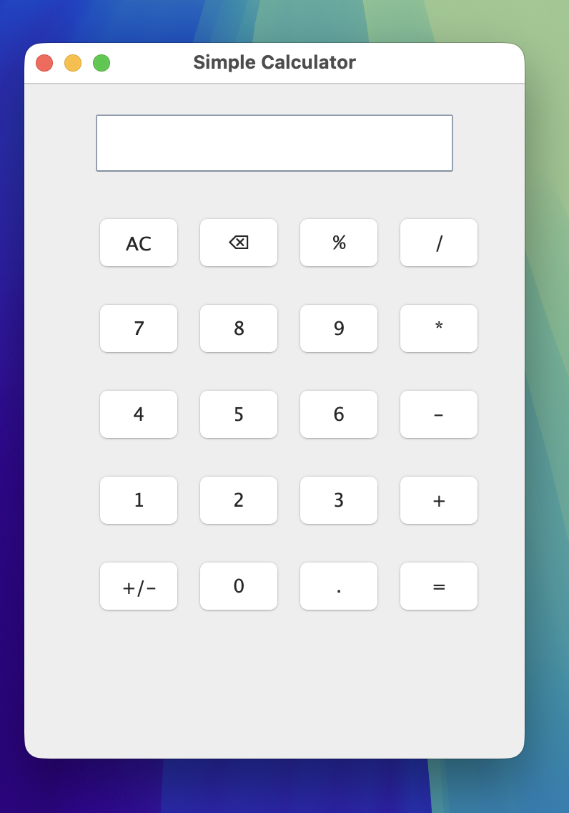

# Java Calculator (AWT)

A simple calculator built using Java AWT as part of my Java learning journey.

## Screenshot

## Features
- Basic operations: +, −, ×, ÷
- Percentage (%)
- Change sign (+/-)
- Backspace and Clear (AC)
- Handles divide-by-zero errors
- Supports expressions like:
  - 8+5
  - 10/2

## Tech Used
- Java
- Java AWT
- IntelliJ IDEA
