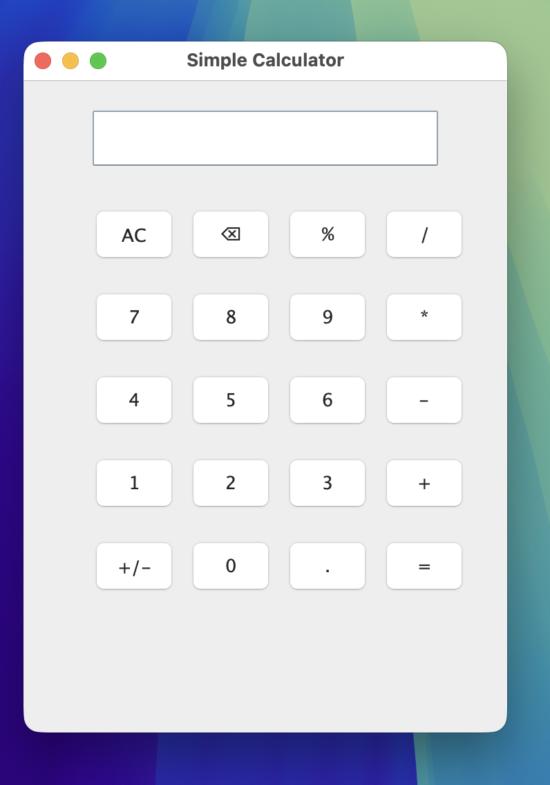

# Java Calculator (AWT)

A simple calculator built using Java AWT as part of my Java learning journey.

## Screenshot.

## Features
-Performs basic arithmetic operations: Addition (+), Subtraction (−), Multiplication (×), and Division (÷).
-Calculates percentages using the % function.
-Changes the sign of a number using the +/- button.
-Includes Backspace (⌫) to delete the last character and All Clear (AC) to reset the calculator.
-Detects and handles divide-by-zero errors gracefully.
-Supports simple arithmetic expressions, such as:
 8 + 5
 10 ÷ 2
 15 - 7
 6 × 4
 
## Tech Used
- Java
- Java AWT
- IntelliJ IDEA.
